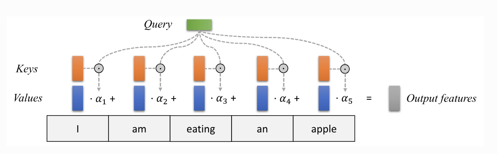

## Transformer架构
### 理解attention最好的图

> https://uvadlc-notebooks.readthedocs.io/en/latest/tutorial_notebooks/tutorial6/Transformers_and_MHAttention.html

### Postion encoding
就是把位置信息调制进内容信息的过程
## 理解生成式AI
**核心思想：对信息进行压缩后还原**  
### 压缩的方式：
1. 丢弃次要因素（dropout）
2. 压缩过大范围（ReLU）
3. 强制拟合（vae，正则）
4. 增强主干因素（resident）
5. 保留主要关联（attention）